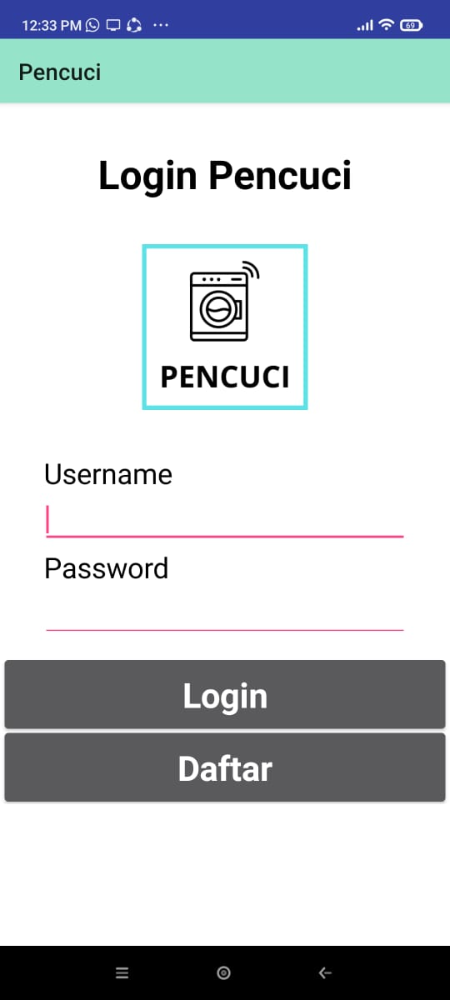

# laundry-kodular
E-Laundry Android
=================

A online laundry android app.

Getting Started
---------------
This project made with kodular. To try it for youself, import "laundry2.aia" to kodular. If you want to try use it, install "laundry2.apk" or "laundry2.abb".

Screenshots
-----------

 
 
 
 

 

 
 
 
 

 

 
 
 
 

 

 
 
 
 

 

 
 
 
 

 

 
 
 
 

 

 
 
 
 

 

 
 
 
 

And more!

Non-Goals
---------
The focus of this project is try to release fully functionality online laundry app
